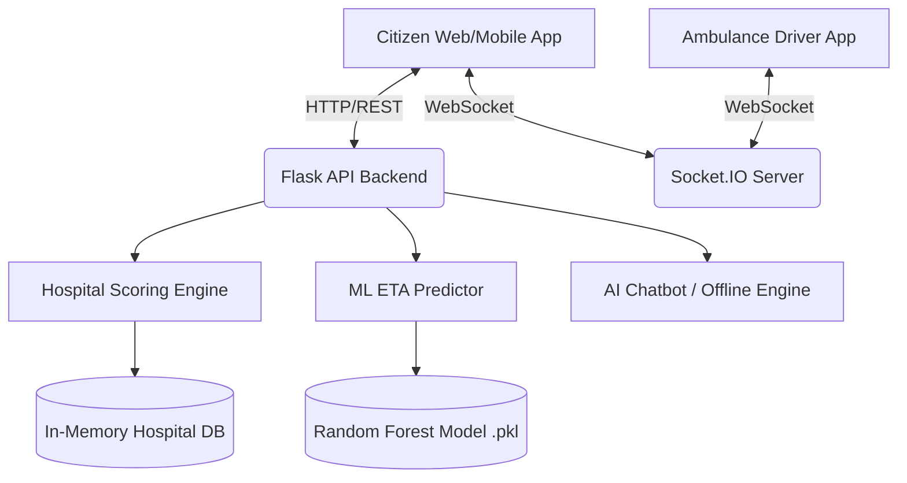

<div align="center">
  <h1>🚨 AI-Driven Emergency & Hospital Optimization System</h1>
  <p><i>A smart, real-time emergency response platform that uses Machine Learning to optimize hospital selection, dispatch ambulances, and predict arrival times.</i></p>

  [](#)
  [](#)
  [](#)
  [-purple)](#)
</div>

---

## Overview

The **AI-Driven Emergency and Hospital Optimization System** bridges the gap between citizens in distress and emergency medical services. By leveraging Machine Learning and real-time WebSockets, this platform ensures patients are routed to the *right* hospital (based on ICU and specialist availability) rather than just the *closest* one, while predicting highly accurate ambulance ETAs.

---

## Core Features

1. **Intelligent Hospital Selection:** Uses a scoring algorithm that weighs geographical distance against real-time hospital resource availability (beds, specialized ICUs).
2. **Real-Time Ambulance Dispatch & Tracking:** Automatically assigns the nearest available ambulance and streams live GPS coordinates to the citizen's device.
3. **Voice-Enabled AI Emergency Assistant:** A contextual chatbot that provides immediate, step-by-step first-aid guidance while the ambulance is en route (powered by Anthropic's Claude, with a robust offline heuristic fallback).
4. **ML-Powered ETA Prediction:** Uses a trained Random Forest Regressor to predict arrival times based on historical traffic patterns, distance, and time of day.
5. **Cross-Platform Accessibility:** Built as a Progressive Web App (PWA) with Capacitor integration, allowing it to be installed as a native app on mobile devices.

---

## Machine Learning & Algorithms

### 1. ETA Prediction Model
Instead of relying on basic distance/speed formulas, the system trains a **Random Forest Regressor** using `scikit-learn` to predict ambulance arrival times.
- **Features Used:** `Distance (km)`, `Traffic Factor (0.0 - 2.0)`, `Hour of Day`, `Day of Week`, `Weather Conditions`.
- **Pipeline:** The model is trained on a generated dataset (`eta_training_data.csv`). It learns non-linear relationships, such as how rush hour traffic disproportionately affects longer routes. 
- **Persistence:** The trained model is serialized using `joblib` (`models/eta_model.pkl`) and loaded into the Flask backend on startup.

### 2. Hospital Recommendation Engine
The system uses a custom scoring algorithm to evaluate hospitals:
```python
# Haversine formula calculates the exact spherical distance
distance = calculate_haversine_distance(patient_loc, hospital_loc)

# Scoring Algorithm (Lower is better)
score = (distance * DISTANCE_WEIGHT) + (10 - beds_available) * CAPACITY_WEIGHT

# Hard constraints: 
# If a patient has a Heart Attack, hospitals without a Cardiac ICU are immediately disqualified.
```

### 3. Smart First-Aid Fallback Engine
If the cloud LLM (Anthropic) is unavailable or no API key is provided, the backend falls back to an intelligent heuristic engine that parses the user's message using Natural Language rules to extract keywords (e.g., "water", "breathing", "CPR") and returns pre-computed, medically safe first-aid instructions specific to the active emergency type.

---

## Technology Stack

### **Frontend (Citizen & Driver Apps)**
- **Framework:** React.js (Single Page Application)
- **Mobile/PWA:** Capacitor (for native wrapping), Web App Manifest, Service Workers
- **Maps:** `react-leaflet` & OpenStreetMap (Free, open-source tile layers)
- **Voice/Speech:** Web Speech API (Native browser Speech-to-Text & Text-to-Speech)
- **Real-time Client:** `socket.io-client`

### **Backend (API & Optimization Engine)**
- **Framework:** Python / Flask
- **Real-time Server:** `Flask-SocketIO` with `gevent` & `gevent-websocket` for asynchronous, non-blocking WebSocket connections.
- **Machine Learning:** `scikit-learn`, `numpy`, `pandas`, `joblib`
- **Geolocation Math:** `geopy` (Haversine distances)
- **LLM Integration:** `anthropic` (Claude 3.5 Sonnet)
- **Telephony Fallback:** `twilio` (Automated phone calls to drivers if they don't accept the WebSocket ping).

---

## System Architecture



---

## Deployment Guide

This project is fully configured for public deployment on modern cloud providers.

### 1. Backend (Render)
1. Push this repository to GitHub.
2. Create a new **Web Service** on [Render](https://render.com).
3. Connect your repository.
4. **Build Command:** `pip install -r backend/requirements.txt`
5. **Start Command:** `gunicorn -k geventwebsocket.gunicorn.workers.GeventWebSocketWorker -w 1 app:app`
6. **Environment Variables:**
   - `PYTHON_VERSION`: `3.11.4` (Critical for gevent compatibility)
   - `ANTHROPIC_API_KEY`: *(Optional)* Your Claude API key.
   - `TWILIO_ACCOUNT_SID` / `TWILIO_AUTH_TOKEN`: *(Optional)* For phone call fallbacks.

### 2. Frontend (Vercel)
1. Import your GitHub repository into [Vercel](https://vercel.com).
2. The framework preset should automatically detect **Create React App**.
3. **Environment Variables:**
   - `REACT_APP_API_URL`: The public URL of your Render backend (e.g., `https://your-backend.onrender.com`).
4. Click **Deploy**.

---

## Local Development

### Prerequisites
- Node.js (v16+)
- Python (3.9+)

### Setup
1. **Clone the repository:**
   ```bash
   git clone https://github.com/YourUsername/ARO.git
   cd ARO
   ```

2. **Start the Backend:**
   ```bash
   cd backend
   python -m venv .venv
   source .venv/bin/activate  # On Windows: .venv\Scripts\activate
   pip install -r requirements.txt
   python app.py
   ```

3. **Start the Frontend:**
   ```bash
   # In a new terminal at the project root
   npm install
   npm start
   ```

4. **Access the Apps:**
   - Citizen App: `http://localhost:3000`
   - Ambulance Driver Simulator: `http://localhost:3000/ambulance?id=KA-01-EM-101`

---

## License & Disclaimer
This project was built for educational and demonstration purposes as part of an intensive hackathon/build sprint. It is **not** intended for actual medical or emergency use without rigorous real-world testing, regulatory compliance, and a persistent, highly available database architecture.
